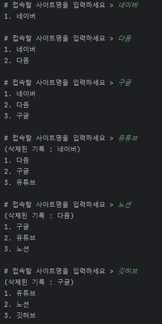

`20240302`

   

      StackTest - 뒤로가기/앞으로가기 기능 구현
   

### ✔️ 변수 구성
1. BufferedReader로 입력받을 이동할 사이트 - <b>site</b>
2. 현재페이지를 저장할 문자열 - <b>now</b>
3. 이전페이지를 저장할 스택 - <b>back Stack</b>
4. 다음페이지를 저장할 스택 - <b>forward Stack</b>

### ✔️ 메서드 구성
1. <b>브라우저 접속 메서드 - go(String site)</b>

   - now가 비어있지 않다면(최초 접속이 아니라면)
   1) back Stack에 now를 저장
   2) now에 site를 저장

2. <b>뒤로가기 메서드 - undo()</b>

   - back Stack이 비어있지 않다면(뒤로 갈 페이지가 있다면)
   1) forward Stack에 now를 저장
   2) now에는 back Stack의 맨 위 데이터를 꺼내서 대입

3. <b>앞으로가기 메서드 - redo()</b>
   - forward Stack이 비어있지 않다면(앞으로 갈 페이지가 있다면)
   1) back Stack에 now를 저장
   2) now에는 forward Stack의 맨 위 데이터를 꺼내서 대입

4. <b>방문기록 메서드 - history()</b>
   1) 이전페이지 출력
   2) 현재페이지 출력
   3) 다음페이지 출력

 

### 📌 메인메서드 호출 순서
`history() 호출은 생략`
1. go("네이버")
2. go("다음")
3. go("구글")
4. undo()
5. redo()
6. go("유튜브")
  

### 🖥️ 출력결과

  

   

      QueueTest - 최근사용문서 기능 구현
   

### ✔️ 체크사항
1. **최근 접속한 사이트 목록**을 *지정된 갯수만큼 유지*한다.

2. **Queue는 인터페이스만 정의**되어 있어 `Queue qu = new Queue();` 가 불가하다.

   - 인터페이스는 직접 구현하거나 구현된 클래스를 사용해야 한다.
     

       
예제에서는 LinkedList를 통해 구현한다.

       - ArrayList는 **조회**할 때, LinkedList는 **삽입/삭제**할 때 좋은 성능을 발휘한다.
       - ArrayList
         - 단순 조회할 때의 속도는 빠르지만, 삽입/삭제 시 배열의 크기를 고려해야 하므로 느림
       - LinkedList
         - 노드 간 연결된 List이기에 삽입/삭제 시 빠른 속도를 보여주지만, 
           내부 원소를 조회할 때는 각 노드들에 일일이 접근하기에 느림
     

### ✔️ 코드 내용
1. 무한 반복문을 돌며 접속할 사이트 입력받기
2. 접속 사이트를 Queue에 저장
3. `최근 접속 사이트 최대 갯수` 이상의 사이트 접속 시 **제일 처음 입력된 데이터 삭제**
4. Queue를 LinkedList로 변환한 후 모든 원소 출력

  

### 🖥️ 출력결과

  

---

    
References

    <a href="https://velog.io/@langoustine/Java-%EC%8A%A4%ED%83%9D%EA%B3%BC-%ED%81%90">https://velog.io/@langoustine</a>

