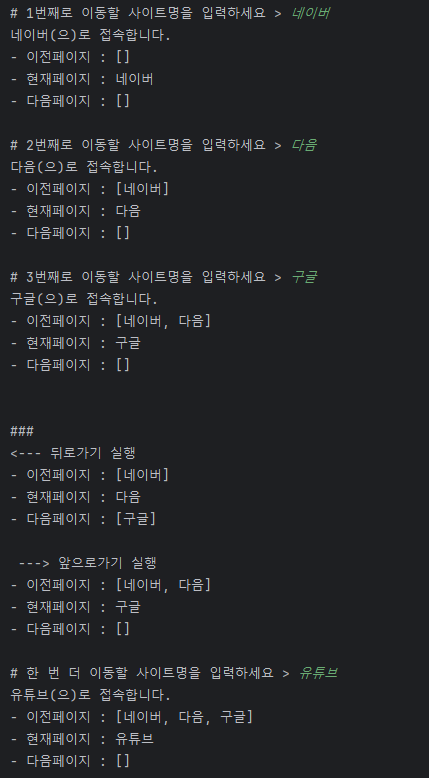

## StackQueueBasic
`20240302`

### ✔️ 변수 구성
1. BufferedReader로 입력받을 이동할 사이트 - <b>site</b>
2. 현재페이지를 저장할 문자열 - <b>now</b>
3. 이전페이지를 저장할 스택 - <b>back Stack</b>
4. 다음페이지를 저장할 스택 - <b>forward Stack</b>

### ✔️ 메서드 구성
1. <b>브라우저 접속 메서드 - go(String site)</b>

    - now가 비어있지 않다면(최초 접속이 아니라면)
    1) back Stack에 now를 저장
    2) now에 site를 저장

2. <b>뒤로가기 메서드 - undo()</b>

    - back Stack이 비어있지 않다면(뒤로 갈 페이지가 있다면)
    1) forward Stack에 now를 저장
    2) now에는 back Stack의 맨 위 데이터를 꺼내서 대입

3. <b>앞으로가기 메서드 - redo()</b>
    - forward Stack이 비어있지 않다면(앞으로 갈 페이지가 있다면)
    1) back Stack에 now를 저장
    2) now에는 forward Stack의 맨 위 데이터를 꺼내서 대입

4. <b>방문기록 메서드 - history()</b>
    1) 이전페이지 출력
    2) 현재페이지 출력
    3) 다음페이지 출력

 

### 📌 메인메서드 호출 순서
`history() 호출 순서는 생략`
1. go("네이버")
2. go("다음")
3. go("구글")
4. undo()
5. redo()
6. go("유튜브")
     

### 🖥️ 출력결과

---

    
References

    <a href="https://velog.io/@langoustine/Java-%EC%8A%A4%ED%83%9D%EA%B3%BC-%ED%81%90">https://velog.io/@langoustine</a>

